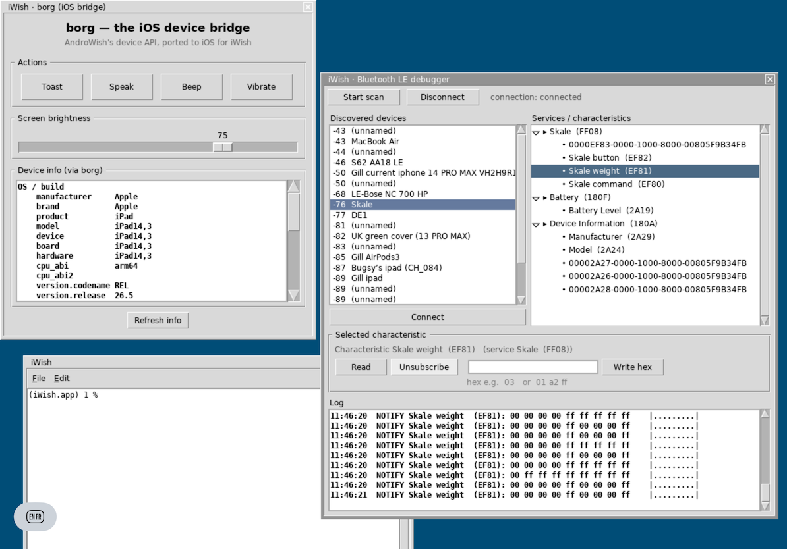

# iWish — Tcl/Tk (AndroWish) on iOS

**iWish** is a port of [AndroWish](https://www.androwish.org/)'s **undroidwish**
— the batteries-included, SDL2-rendered Tcl/Tk `wish` — to **iOS / iPadOS**.

It runs a real Tcl 8.6 interpreter and a real Tk 8.6 widget set on an iPad or
iPhone, with Tk drawn through AndroWish's `SdlTk` (an X11-on-SDL2 emulation
layer) using the **AGG** anti-aliased renderer and **FreeType** for text — no
WebView, no native-UIKit-widget bridge, just the actual Tk canvas/widgets
composited onto an SDL2 Metal surface.

> **Status: 0.2 — alpha.** The runtime is real and complete enough to run a
> large, real-world third-party Tk application end-to-end on a physical iPad —
> full GUI, the batteries-included extension set (**~114 bundled packages, 64 of
> them native `arm64-apple-ios` dylibs**), a **File ▸ Demos** menu of bundled
> apps, and talking to hardware over CoreBluetooth. APIs, the build layout, and
> the bundled extension set are still in flux. Expect sharp edges. See
> [`BUGS.md`](BUGS.md) and [`TODO.md`](TODO.md).
>
> **Installing the app:** see [`INSTALL.md`](INSTALL.md) (Sideloadly / AltStore /
> from source / EU notarized). **AI agents:** start at [`AGENTS.md`](AGENTS.md).
>
> **Talk (EuroTcl 2026):** a 23-slide walkthrough of the port — the lineage from
> undroidwish, the architecture, `borg`/`ble`, iOS 9 / armv7 + jailbreak, App
> Review, and every install path. Read [`iWish-for-iOS.pdf`](iWish-for-iOS.pdf),
> or open the editable [`iWish-for-iOS.pptx`](iWish-for-iOS.pptx).

This repo is a **recipe**: build scripts, a set of patches against upstream, and
the iOS-native glue code. It does **not** redistribute the AndroWish, SDL2, or
Tcl/Tk sources (each has its own license); you fetch those and apply these
patches.

A sibling repo,
[`undroidwish-arm64-batteries-included`](https://github.com/johnbuckman/undroidwish-arm64-batteries-included),
builds the same stack as a native Apple-Silicon **macOS** binary; several of the
non-UIKit fixes (the `size_t`/`pid_t` BLT bug, libpng NEON, TIFF codecs, the
arm64 toolchain flags) are shared and documented there.

A second sibling repo,
[`androwish-ios9`](https://github.com/johnbuckman/androwish-ios9), is instead a
**full-source, clone-and-build** snapshot for **32-bit armv7 / iOS 9** (old
32-bit devices such as the jailbroken iPad mini 1, A5) — AndroWish's Tcl/Tk plus
all its batteries in one checkout, with the armv7 build scripts, NDK+Apple
toolchain wrappers, and a bundled iOS-9-patched SDL2 included. Use that if you
want the whole source rather than patches to apply.

<p align="center">
  
</p>

<p align="center"><em>iWish on an iPad: the <code>borg</code> device bridge, a live BLE debugger, and a real <code>wish</code> console.</em></p>

## What works

- Tcl 8.6.10 + Tk 8.6 widgets on a real iOS device, the simulator, and Mac
  Catalyst — the Tk canvas, fonts, buttons, scales, checkbuttons, etc. render
  edge-to-edge and fill the native screen.
- Built `-DTCL_UTF_MAX=6` (UCS-4) so astral-plane characters and arrows render
  correctly (stock builds are UTF_MAX=3 and garble them).
- A large bundled extension set built for `arm64-apple-ios` (~114 packages, 64
  native dylibs): tkimg (jpeg/png/tiff), tls (LibreSSL), TclCurl, sqlite3, itcl,
  itk, thread, tdom, Tktable, tktreectrl, zint, Img, tkpath, tkvnc, BLT 2.4,
  **TkBLT** (scientific plotting — `blt::graph`/`barchart`/`vector`), **Tix**,
  **vectcl**, tksvg, and more.
- A **File ▸ Demos** menu in the console (added by [`launcher/main.tcl`](launcher/main.tcl))
  that launches the bundled demo apps — including four iWish-specific ones in
  [`demos/`](demos): `bltgraph` (TkBLT plotting), `bledemo` (a LightBlue-style
  BLE debugger), `borgdemo` (the `borg` iOS bridge), and `paint`. Extensions that
  can't exist on iOS appear greyed-out.
- iOS-native shims (under [`src-ios/`](src-ios)) that re-implement the AndroWish
  `borg` and `ble` commands on Apple frameworks:
  - **`borg`** → `UIScreen` brightness, `UIDevice`/`UIScreen` info, `UIApplication
    openURL`, AVSpeech, a native `toast` (via [scalessec/Toast](https://github.com/scalessec/Toast)),
    plus a `platform` subcommand (`ios`/`iossimulator`/`maccatalyst`) so Tcl can
    identify the run target at runtime.
  - **`ble`** → CoreBluetooth (scan / connect / read / write / notify), using the
    peripheral's CB UUID as its "address" since iOS hides the MAC.
  - **`hardexit`** ([`src-ios/hardexit/`](src-ios/hardexit)) → a one-command dylib
    that calls `_exit()`. On iOS Tcl's normal `exit` (which runs `Tcl_Finalize`)
    hangs and leaves a blank window; load this and route `exit` through it for a
    clean quit. Generic to any iWish app.

## How it's built

The runtime is `sdl2wish` — undroidwish's single binary with Tcl, Tk/SdlTk, SDL2,
AGG and FreeType statically linked — compiled for `arm64-apple-ios15.0`. The
scripts in [`scripts/`](scripts) drive it:

| script | builds |
|--------|--------|
| `build-device.sh`  | the foundation: FreeType, SDL2, AndroWish Tcl, sdl2tk + `sdl2wish` (all UTF6, `arm64-apple-ios`) |
| `build-ext-dev.sh` | the loadable extension stack (tkimg, tls, TclCurl, tksvg, sqlite3, itcl, thread, zint) |
| `build-blt-dev.sh` | BLT 2.4 (`libBLT24`) |
| `build-tkblt-dev.sh` | TkBLT 3.2 — plotting widgets (`blt::graph`/`barchart`/`vector`); see [`demos/bltgraph.tcl`](demos/bltgraph.tcl) |
| `build-device-batteries.sh` | stage the full battery set (~114 packages) into a bundle's `lib-batteries/` |
| `build-utf6.sh`    | rebuilds Tcl/sdl2tk at `TCL_UTF_MAX=6` |

The app's entry point is [`launcher/main.tcl`](launcher/main.tcl) (auto-run by the
patched `tkAppInit.c`): it boots the Tk console, loads `borg`, builds the
**File ▸ Demos** menu, and positions the windows. The custom demos it lists live
in [`demos/`](demos).

The shims in `src-ios/` are compiled to `borg1.0`/`ble1.0`/`hardexit` loadable
dylibs (see the comments at the top of each `.c`/`.m` for the exact `clang` line).

Two more helper scripts package the result:

| script | does |
|--------|------|
| `build-icon.sh <image> [<app>]`              | any image → opaque 1024 → `actool` `AppIcon` asset catalog (`Assets.car`), optionally copied into a bundle |
| `sign-and-install-device.sh <app> <identity> <profile> <udid> [entitlements]` | sign nested dylibs + the app and `devicectl install` to a device |

### The patches

The central insight in the macOS sibling repo is that SDL2's `configure`
mis-detects an Apple-Silicon Mac as iOS. For **actual iOS** the work is the
opposite: making SDL2's UIKit backend host a Tk app well, and giving the Tcl
runtime the iOS-sandbox environment it expects.

| patch | what |
|-------|------|
| `patches/androwish-tkAppInit.c.patch` | on iOS there is no `TCL_LIBRARY`/`TK_LIBRARY` env, so `init.tcl`/`tk.tcl` abort; set the script-library paths from the bundle and auto-run `main.tcl` |
| `patches/androwish-SdlTkX.c.patch`, `…-SdlTkInt.c.patch`, `…-SdlTkGfx.c.patch` | pin SdlTk's virtual screen to the native size and scale-to-fill the real drawable; map input back; render fixes |
| `patches/sdl2/SDL_uikitviewcontroller.m.patch` | scene/geometry config so the window fills the screen; hide the iOS status bar (`prefersStatusBarHidden` + a forced `setNeedsStatusBarAppearanceUpdate`) |
| `patches/sdl2/SDL_uikitvideo.m.patch` | make `SDL_DisableScreenSaver` (idle-timer) safe on iOS (was Catalyst-only) |
| `patches/sdl2/SDL_uikitview.m.patch`, `…window.m.patch`, `…modes.m.patch`, `…events.m.patch` | UIKit window/view/mode integration for the Tk surface |

Apply them with [`apply-patches.sh`](apply-patches.sh):

```sh
./apply-patches.sh /path/to/androwish /path/to/SDL2-2.30.11
```

(Patches are against AndroWish's bundled `jni/sdl2tk` and a stock **SDL 2.30.11**
tree. The iWish changes are also marked inline with `iwish:` comments.)

## Build (outline)

1. Get an AndroWish checkout and a stock SDL 2.30.11 source tree.
2. `./apply-patches.sh <androwish> <SDL2-2.30.11>`.
3. Run `scripts/build-device.sh` (edit the path variables at the top first),
   then `scripts/build-ext-dev.sh` and `scripts/build-blt-dev.sh`.
4. Compile the `src-ios/` shims to dylibs.
5. Assemble a `.app`: the `sdl2wish` binary (renamed), `lib/tcl8.6` + `lib/tk8.6`,
   your `main.tcl` + payload, an `Info.plist` (landscape orientations, status bar
   hidden, `MinimumOSVersion 15.0`), and — for the full battery set — a
   `lib-batteries/` of the extension dylibs.
6. Build the icon: `scripts/build-icon.sh <image> <your.app>`.
7. Sign + install: `scripts/sign-and-install-device.sh <your.app> <identity> <profile> <udid> [entitlements]`
   — needs an Apple Development cert + a provisioning profile that includes the
   device UDID.

The app icon master is [`assets/AppIcon.icns`](assets/AppIcon.icns) (the iWish
apple + Tcl-feather mark); [`assets/iwish-icon-1024.png`](assets/iwish-icon-1024.png)
is its 1024×1024 opaque export for the build. `scripts/build-icon.sh` compiles
the PNG with `actool` into an `AppIcon` asset catalog (`Assets.car` +
`AppIcon*.png`); reference `CFBundleIconName AppIcon` in your `Info.plist`. iOS
icons must be a single opaque 1024×1024 image — iOS applies its own
rounded-corner mask.

## Built-in Unix-style commands

iOS sandboxes `fork`/`exec`, so Tcl's `exec ls`, `exec cat`, `exec cp`, ... can
never work in a packaged app. [`scripts/unix-commands.tcl`](scripts/unix-commands.tcl)
supplies pure-Tcl replacements for the common filesystem/text utilities:

> `ls` `cat` `head` `tail` `grep` `wc` `cp` `mv` `rm` `mkdir` `rmdir` `touch`
> `ln` `chmod` `du` `find` `basename` `dirname` `echo`

These are **runtime built-ins, not console helpers**: the runtime sources
`unix-commands.tcl` from `lib/tcl8.6/init.tcl`, so the commands exist in *every*
interpreter and are available to all Tcl programs, not just the interactive
console. They never override a name a program already defines, and they don't
re-implement things Tcl already has (`pwd`, `cd`, `clock`, `glob`, `file`, ...).
Process/volume/network utilities (`ps`, `kill`, `df`, `ping`, ...) are left
undefined — they need `exec` or privileged syscalls iOS forbids; use Tcl's
`http`/`socket`/TclCurl for networking.

**Wiring it into the runtime** (assembly step): copy `unix-commands.tcl` into the
bundle's `lib/tcl8.6/` and append one line to that dir's `init.tcl`:

```tcl
catch {source [file join $tcl_library unix-commands.tcl]}
```

A bare runtime smoke-test `main.tcl` is then just:

```tcl
package require Tk
wm title . "iWish"
console show
```

The **0.2-alpha release** attaches a prebuilt **`iWish.ipa`** — the full
batteries-included build (~114 packages) with the Demos menu — for
`arm64-apple-ios`. It is a development build; **re-sign it for your own
device/team before installing** (Sideloadly/AltStore do this automatically). See
[`INSTALL.md`](INSTALL.md) for every install path.

## License

The patches, scripts, shims, and documentation here are licensed under the
**Tcl/Tk license** (a BSD-style license; see [`LICENSE`](LICENSE)). They are
modifications to / instructions for AndroWish, SDL2, and Tcl/Tk; **those projects
and the third-party libraries they bundle retain their own original licenses.**

`src-ios/borg-ios/UIView+Toast.{h,m}` are from
[scalessec/Toast](https://github.com/scalessec/Toast) and remain under their
original **MIT** license (© Charles Scalesse), used by `borg toast`.
